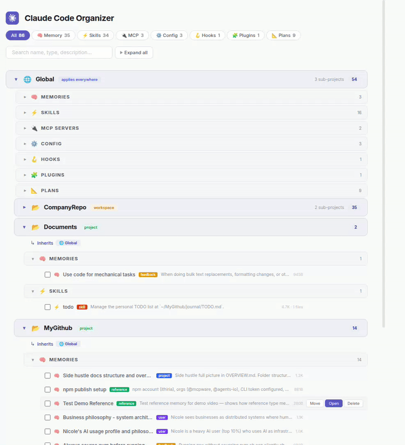

# Claude Code Organizer

[](https://www.npmjs.com/package/@mcpware/claude-code-organizer)
[](https://www.npmjs.com/package/@mcpware/claude-code-organizer)
[](https://github.com/mcpware/claude-code-organizer/stargazers)
[](https://github.com/mcpware/claude-code-organizer/network/members)
[](LICENSE)
[](https://nodejs.org)

[English](README.md) | [简体中文](README.zh-CN.md) | [繁體中文](README.zh-TW.md) | [廣東話](README.zh-HK.md) | [日本語](README.ja.md) | [한국어](README.ko.md) | [Español](README.es.md) | [Bahasa Indonesia](README.id.md) | [Italiano](README.it.md) | [Português](README.pt-BR.md) | [Türkçe](README.tr.md) | Tiếng Việt | [ไทย](README.th.md)

**Sắp xếp toàn bộ memory, skill, MCP server và hook của Claude Code; xem theo cây scope, di chuyển giữa các scope bằng drag-and-drop.**



## vấn đề

Claude Code âm thầm tạo memory, skill và config MCP mỗi khi bạn làm việc, rồi đẩy chúng vào scope nào khớp với thư mục hiện tại. Một preference lẽ ra áp dụng ở mọi nơi? Bị kẹt trong một Project. Một skill deploy chỉ dành cho một repo? Lại rơi vào Global, làm nhiễu mọi project khác.

**Đây không chỉ là chuyện bừa bộn, nó còn làm AI của bạn kém chính xác hơn.** Mỗi session, Claude nạp toàn bộ config ở scope hiện tại cùng mọi thứ kế thừa từ scope cha vào context window. Những item nằm sai scope = tốn token, bẩn context, giảm độ chính xác. Một skill cho Python pipeline nằm ở Global sẽ bị nạp cả vào session React frontend. MCP entry trùng nhau có thể khởi tạo cùng một server hai lần. Memory cũ thì mâu thuẫn với chỉ dẫn hiện tại của bạn.

### "cứ bảo Claude tự sửa đi"

Bạn vẫn có thể bảo Claude Code tự dọn config cho nó. Nhưng rồi sẽ lại phải lần từng bước: `ls` từng thư mục, `cat` từng file, ghép bức tranh tổng thể từ một loạt output rời rạc. **Không có lệnh nào cho bạn thấy toàn bộ cây** của mọi scope, mọi item và toàn bộ quan hệ kế thừa trong cùng một màn hình.

### cách giải quyết: dashboard trực quan

```bash
npx @mcpware/claude-code-organizer
```

Chỉ một lệnh. Bạn sẽ thấy toàn bộ những gì Claude đang lưu, sắp theo cây scope. **Kéo item giữa các scope.** Xóa memory cũ. Tìm item trùng. Lấy lại quyền kiểm soát những gì thực sự ảnh hưởng đến cách Claude hoạt động.

### ví dụ: Project → Global

Bạn từng nói với Claude "I prefer TypeScript + ESM" khi đang đứng trong một project, nhưng preference đó áp dụng ở mọi nơi. Mở dashboard, kéo memory đó từ Project sang Global. **Xong. Một cú kéo.**

### ví dụ: Global → Project

Một skill deploy đang nằm ở Global nhưng thực ra chỉ có ý nghĩa với một repo. Kéo nó vào scope Project tương ứng, các project khác sẽ không còn thấy nó nữa.

### ví dụ: xóa memory cũ

Claude có thể tự tạo memory từ những câu bạn nói vu vơ, hoặc từ những gì nó *nghĩ* là nên nhớ. Một tuần sau, chúng không còn liên quan nhưng vẫn bị nạp vào mọi session. Mở ra, đọc, xóa. **Bạn quyết định Claude nên "biết" gì về mình.**

---

## tính năng

- **Nhìn theo cây scope**: Thấy toàn bộ item được sắp theo Global > Workspace > Project, kèm dấu hiệu kế thừa
- **Drag-and-drop**: Di chuyển memory giữa các scope, skill giữa Global và từng repo, MCP server giữa các config
- **Xác nhận trước khi di chuyển**: Mỗi lần move đều hiện modal xác nhận trước khi đụng vào file
- **An toàn theo từng loại item**: Memory chỉ có thể move vào thư mục memory, skill vào thư mục skill, MCP vào config MCP
- **Tìm kiếm và lọc**: Tìm tức thì trên toàn bộ item, lọc theo nhóm (Memory, Skills, MCP, Config, Hooks, Plugins, Plans)
- **Panel chi tiết**: Bấm vào bất kỳ item nào để xem đầy đủ metadata, mô tả, file path và mở trong VS Code
- **Quét đầy đủ theo từng project**: Mỗi scope đều hiển thị đủ mọi loại item: memory, skill, MCP server, config, hook và plan
- **Di chuyển file thật**: Tool thực sự move file trong `~/.claude/`, không phải chỉ để xem
- **45 bài test E2E**: Bộ test Playwright có xác minh filesystem thật sau mỗi thao tác

## vì sao cần dashboard trực quan?

Claude Code vốn đã có thể liệt kê và di chuyển file qua CLI, nhưng dùng cách đó thì bạn sẽ phải dò config của chính mình theo kiểu hỏi tới hỏi lui từng chút một. Dashboard cho bạn **cái nhìn toàn cảnh chỉ trong một màn hình:**

| Việc bạn cần | Nhờ Claude | Dashboard trực quan |
|---------------|:-----------:|:----------------:|
| **Xem tất cả cùng lúc** trên mọi scope | `ls` từng thư mục rồi tự ghép lại | Cây scope, nhìn là thấy |
| **Project hiện tại đang nạp gì?** | Chạy nhiều lệnh, hy vọng không sót | Mở project → thấy toàn bộ chuỗi kế thừa |
| **Move item giữa các scope** | Lần mò path đã encode, `mv` thủ công | Drag-and-drop có xác nhận |
| **Đọc nội dung config** | `cat` từng file một | Bấm → panel bên |
| **Tìm item trùng / item cũ** | `grep` trong các thư mục khó đọc | Search + filter theo category |
| **Dọn memory không còn dùng** | Tự suy ra file nào nên xóa | Duyệt, đọc, xóa ngay tại chỗ |

## bắt đầu nhanh

### tùy chọn 1: npx (không cần cài đặt)

```bash
npx @mcpware/claude-code-organizer
```

### tùy chọn 2: cài đặt global

```bash
npm install -g @mcpware/claude-code-organizer
claude-code-organizer
```

### tùy chọn 3: nhờ Claude

Dán đoạn này vào Claude Code:

> Chạy `npx @mcpware/claude-code-organizer` — đây là một dashboard để quản lý thiết lập của Claude Code. Khi sẵn sàng thì báo cho tôi URL.

Dashboard sẽ mở tại `http://localhost:3847`. Dùng trực tiếp với thư mục `~/.claude/` thật của bạn.

## công cụ này quản lý gì

| Loại | Xem | Di chuyển | Quét tại | Tại sao bị khóa? |
|------|:----:|:----:|:----------:|-------------|
| Memories (feedback, user, project, reference) | Có | Có | Global + Project | - |
| Skills | Có | Có | Global + Project | - |
| MCP Servers | Có | Có | Global + Project | - |
| Config (CLAUDE.md, settings.json) | Có | Khóa | Global + Project | Thiết lập hệ thống, move nhầm có thể làm hỏng config |
| Hooks | Có | Khóa | Global + Project | Phụ thuộc vào context của settings, move sang chỗ khác có thể lỗi âm thầm |
| Plans | Có | Có | Global + Project | - |
| Plugins | Có | Khóa | Chỉ Global | Cache do Claude Code quản lý |

## cây scope

```bash
Global                       <- applies everywhere
  Company (workspace)        <- applies to all sub-projects
    CompanyRepo1             <- project-specific
    CompanyRepo2             <- project-specific
  SideProjects (project)     <- independent project
  Documents (project)        <- independent project
```

Scope con sẽ kế thừa memory, skill và MCP server từ scope cha.

## cách hoạt động

1. **Quét** `~/.claude/` — phát hiện toàn bộ project, memory, skill, MCP server, hook, plugin và plan
2. **Xác định cây scope** — suy ra quan hệ cha-con từ các path trong filesystem
3. **Render dashboard** — header scope > thanh category > từng dòng item, với độ thụt đúng
4. **Xử lý thao tác move** — khi bạn kéo hoặc bấm "Move to...", tool sẽ thực sự move file trên đĩa kèm các kiểm tra an toàn

## so sánh

Chúng tôi đã xem qua mọi tool cấu hình Claude Code mà tìm được. Không có tool nào vừa cho cây scope trực quan vừa hỗ trợ drag-and-drop giữa các scope trong một dashboard chạy độc lập.

| Điều tôi cần | Desktop app (600+⭐) | VS Code extension | Full-stack web app | **Claude Code Organizer** |
|---------|:---:|:---:|:---:|:---:|
| Cây scope | Không | Có | Một phần | **Có** |
| Move bằng drag-and-drop | Không | Không | Không | **Có** |
| Move giữa các scope | Không | One-click | Không | **Có** |
| Xóa item cũ | Không | Không | Không | **Có** |
| Tool MCP | Không | Không | Có | **Có** |
| Zero dependencies | Không (Tauri) | Không (VS Code) | Không (React+Rust+SQLite) | **Có** |
| Chạy độc lập (không cần IDE) | Có | Không | Có | **Có** |

## hỗ trợ nền tảng

| Nền tảng | Trạng thái |
|----------|:------:|
| Ubuntu / Linux | Được hỗ trợ |
| macOS (Intel + Apple Silicon) | Được hỗ trợ (community-tested trên Sequoia M3) |
| Windows | Chưa hỗ trợ |
| WSL | Có thể chạy được (chưa test) |

## cấu trúc project

```bash
src/
  scanner.mjs       # Scans ~/.claude/ — pure data, no side effects
  mover.mjs         # Moves files between scopes — safety checks + rollback
  server.mjs        # HTTP server — routes only, no logic
  ui/
    index.html       # HTML structure
    style.css        # All styling (edit freely, won't break logic)
    app.js           # Frontend rendering + SortableJS + interactions
bin/
  cli.mjs            # Entry point
```

Frontend và backend tách riêng hoàn toàn. Bạn có thể sửa các file trong `src/ui/` để đổi giao diện mà không phải chạm vào logic.

## API

Phía sau dashboard là một REST API:

| Endpoint | Method | Mô tả |
|----------|--------|-------------|
| `/api/scan` | GET | Quét toàn bộ tùy chỉnh, trả về scopes + items + counts |
| `/api/move` | POST | Move một item sang scope khác (hỗ trợ phân biệt theo category/name) |
| `/api/delete` | POST | Xóa vĩnh viễn một item |
| `/api/restore` | POST | Khôi phục file đã xóa (để undo) |
| `/api/restore-mcp` | POST | Khôi phục một MCP server entry đã xóa |
| `/api/destinations` | GET | Lấy danh sách đích move hợp lệ cho một item |
| `/api/file-content` | GET | Đọc nội dung file cho panel chi tiết |

## giấy phép

MIT

## thêm từ @mcpware

| Dự án | Chức năng | Cài đặt |
|---------|---|---|
| **[Instagram MCP](https://github.com/mcpware/instagram-mcp)** | 23 tool Instagram Graph API — bài đăng, bình luận, DM, story, analytics | `npx @mcpware/instagram-mcp` |
| **[UI Annotator](https://github.com/mcpware/ui-annotator-mcp)** | Gắn nhãn hover trên mọi trang web để AI gọi phần tử theo tên | `npx @mcpware/ui-annotator` |
| **[Pagecast](https://github.com/mcpware/pagecast)** | Ghi lại phiên duyệt web thành GIF hoặc video qua MCP | `npx @mcpware/pagecast` |
| **[LogoLoom](https://github.com/mcpware/logoloom)** | Thiết kế logo bằng AI → SVG → xuất trọn bộ nhận diện thương hiệu | `npx @mcpware/logoloom` |

## tác giả

[ithiria894](https://github.com/ithiria894) - Xây công cụ cho hệ sinh thái Claude Code.
